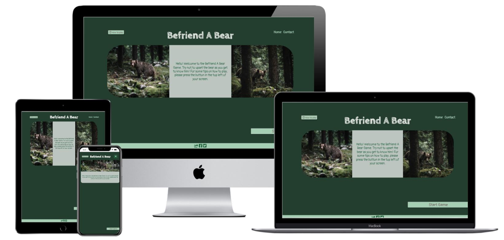

# Befriend A Bear

## Overview

A website for playing a game revolving around answering questions on how to react in different scenarios whilst trying to make friends with a bear. The website features a home page with the game as well as instructions on how to play it, and a contact page to make the creator aware of any issues with the game or suggest any new content. For this website, the primary goal is for users to enjoy the game, share it with their friends and interact with the website's social media pages.

This website tries to make the game as intuitive and enjoyable as possible to play. It also tries to make getting in contact with the developers easy and possible through a number of channels.

# Index

## UX

### **Strategy**

The business goals of this website are:
* To raise awareness of the game and it's developer.
* To provide distinguished and intuitive UX to enable users to spend long enough on the site long enough to share the link with friends and interact on the website's social media pages.

The customer goals of this website are:
* To play a fun game.
* To intuitively understand how the game is played, but be able to find further information if needed.
* To learn some information about bears.
* To find something enjoyable they can share with their friends.
* To intuitively navigate to the contact page to detail any issues or recommendations.

Visitors to this website are searching for:
* A fun and unique game.
* A game which can be played more than once in an attempt to improve their score.
* A game which has content based on bears and their behaviour.

This website is the best way to help them achieve these things because:
* Few games have bear-based content.
* This website is:
    * Intuitive and easy to navigate.
    * Able to guide the user through the game in a way that is easy to understand.
    * Able to guide them to the goal of the website - to get in contact via the form or social media pages.

#### Client stories

1. As a new visitor to the website, I want to easily navigate around the site so that I can find what I’m looking for as quickly as possible.
2. As a new visitor to the website, I want to be able to find the rules of the game so that I can understand how to play.
3. As a new visitor to the website, I want to be able to play the game soon after visiting the site to have fun.
4. As a new visitor to the website, I want to understand how to fill out the form on the Contact page so that I can ask any questions I may have.
5. As an interested user, I want to be able to share the game with my friends so that they can play too.
6. As an interested user, I want to navigate to social media pages so that I can learn of any other games available or in development.
7. As a returning visitor to the website, I want to easily navigate to the contact page so that I can give suggestions of game developments.
8. As an animal lover, I want to be able to play a game related to animals so that I can learn more about them.

### **Scope**

Based on the simple customer and business goals of Befriend a Bear, the majority of the scope of the project will focus on the game and associated feedback and interactivity with some basic features to support the business goals of the website.

#### Initial Feature Plan

These items must be completed for initial release:

* A Home page containing a game which can be played until the user either fails or completes the game and can then be restarted.
* A contact form allowing the user to provide detailed descriptions of suggestions to improve or develop the game, or to ask questions about the game.

### **Structure**

#### Consistency Predictability and Learnability:

This website will follow convention for its navigational elements. Predictably, these will be found at the top right of the browser window on any screen size and will be consistent in their colouring and design (although smaller screen sizes will offer a drop down option for the menu, again following convention).
Consistency will also be applied to the title on both pages and any other boxes of information a user may need to understand quickly when visiting a page for the first time.
This will give the website a high learnability and will be largely intuitive for finding the game or moving through to the Contact page. 

#### Visibility:

The website will encapsulate the vast majority of the content of each page into the viewport so the user can immediately see and understand the purpose of the page.

#### Feedback:

Feedback will be added to the website for links as well as the submission button for the planned contact form. The form will also provide feedback should there be an error with any of the form entries.
Whilst playing the game, feedback will highlight to the user the impacts of their decisions as well as the outcome of the game.

### **Skeleton**

#### Wireframe mockups: 

** The wireframes for the Home page have been created not to show the layout of the page upon load, but to show how and where each element will be displayed throughout gameplay.**

Wireframes First Drafts:

* [Home](assets/images/readme-images/wireframe-draft-home.jpg)
* [Contact](assets/images/readme-images/wireframe-draft-contact.jpg)

Upon searching for and finding images for the website, it became clear that trying to fit one image across the majority of the viewport didn't make for the best UX. Not only was the image not always centered on the bear at different screen sizes, but depending on the image position the question and response content contrast was occasionally not sufficient. To rectify this, the layout was adapted to sandwich the question and response content between two images to provide a more impactful and clear message that better suits the image ratios. 

There were several additions to the Home page wireframes related to additional features added throughout the website's development. A "How to play" button was implemented within the Header of the Home page. The reason for this placement was so that it was one of the first items a user comes across and also so that it is easily accessible throughout gameplay. Another item not in the initial feature plan is the Friendship Score display which in the final Home wireframe is visible during the game next to Lives Remaining. 

Another change resulting from an increased scope was the 404 error page. This was added to improve UX on the chance that the user would navigate to a non existent page. As the website currently has only two main pages, this is unlikely to happen. However, this addition does provide some future proofing should the website be developed further at a later date.

The social media icons contained within the footer of each page were centered rather than being displayed on the right hand side. This decision was influenced by the business goals of the website to encourage sharing of the game through the website link and social media links.

Wireframes Final Versions:

* [Home](assets/images/readme-images/wireframe-final-home.jpg)
* [Contact](assets/images/readme-images/wireframe-final-contact.jpg)
* [404](assets/images/readme-images/wireframe-final-404.jpg)

#### Implemented Features

Both pages feature a typical header that users will be familiar with; a responsive navigation bar which includes the game title in the centre of the header and links to the website’s other page in the top right. They all also feature a footer with page sharing details as well as social media icons which link to the game's facebook and twitter pages. The icon for sharing within the footer triggers a modal to appear which displays the url of the website and provides a button to **copy to clipboard** to better faciliate the sharing of the website. Once copied, an **alert** appears notifying the user of this action.

Throughout the website, links and buttons provide **feedback** to the user when clicked or hovered over in the form of font or border changes to make the user intuitively infer what their actions on the website will result in.
 
##### Home:
 
The header of the Home page only contains an instructional, **interactive modal**. This is included in the header so that it is easily located throughout any stage of the game and can be referred back to at any time on this page.

The main focal point of the page includes **photographs** relevant to the game content surrounding a compelling introduction which entices users into the game. Nestling the introduction between the images this way helps to draw the user's eye quickly to the most important part of the page. On smaller screen sizes, only one image is displayed as this gives a cleaner view of the introduction and therefore better conveys the purpose of the website, and also reduces the mobile users’ data consumption.

The last feature visible upon page load is the **Start Game button** which, when clicked, changes the layout of the lower half of the page to include more **interactive buttons**. It also changes the text content of what was the introduction to the first in a serious of questions for the game. The recycling of this area makes the most of the space and takes advantage of the user's eye naturally being drawn to that area.

Now, as well as the interactive buttons we have some **icons** displayed at the bottom left of the screen for Lives Remaining and Friendship Score. Throughout gameplay, the numbers displayed within these icons will change depending upon whether the user gets each question right or wrong. For an incorrect answer, the Lives Remaining and Friendship Score decrease by one and the number displayed withing the icons will flash red. At the same time, the word "Wrong" will flash across the screen in red to reinforce the consequence of the user's action. Conversely, for a correct answer, the Friendship Score will increase by one and the number will flash blue, as well as having the word "Correct" flash across the screen in blue for maximum feedback to the user on each question without interfering with gameplay.

When the game ends, either through the user running out of lives or reaching the end of the question bank, a modal appears revealing the score of the user. Along with the score, there is some text that, depending on the score, either congratulates the user for achieving the maximum score possible or encourages them to try again. 
 
##### Contact:
 
The Contact page contains a **contact form** that a user can fill in for multiple reasons. The form contains fields for first and last name, email, a dropdown for the reason for contact and details for anything that may be relevant.

At the end of the form there is an **Enquire Now** button which triggers a **modal** to appear when clicked. The content on the modal depends on the data within the form. As well as the usual html validation checks, custom javascript loops through each form field to check for errors. If errors are detected, this is fed back to the user via the modal and the form is not submitted. If the fields pass **validation**, the user is thanked for their submission and the form is submitted.
 
#### Sprint 1 Features
 
- Game Title - Exists on every page, is distinctive and allows users to get a feel for the game. Clicking the logo returns users to the home page as per convention.
- Header Navigation Bar - Exists on every page and allows users to easily navigate both of the website's pages and quickly find what they are looking for.
- Footer Share Button - Exists on every page and offers a very quick and easy way for users to share the website's link through any means of their choosing.
- Footer Social Media Icons - Exist on every page and allow users to access the social platforms Befriend A Bear.
- Basic Game Functionality - Exists on Home page and allows users to interactively answer questions and receive a response.
- How to Play - Exists on Home Page and displays a modal to explain the how the game works.
- Lives Remaining - Exists on Home page and displays a certain number of lives to the user which decreases with each wrong answer.
- Friendship Score - Exists on Home page and displays a score based on the number of right and wrong answers a user selects.
- End Game Modal - Exists on Home page and displays a score and text to encourage further gameplay.
- Contact Form - Exists on the Contact page and allows users to ask questions or suggest improvements.
- Contact Form Validation - Exists on the Contact page and prevents users from submitted empty data fields or incorrect data types to fields.

#### Sprint 2 Features (Future)

- Increased Question Bank - with new ideas from the developer and from users, over time the question bank can increase.
- Difficulty Setting and Score Multiplier - with an increased bank of questions, a difficulty setting can be introduced which impacts the number of Lives a user starts the game with as well as the final score.
- Increased Specificity in Contact Form Validation - currently the feedback provided to the user states there is a problem, but does not provide details. 
 
### **Surface**

#### Colour Scheme

The website has a dark green colour scheme with brown accents to reinforce the game's forest setting. The image choices for the website also match this colour scheme.

#### Typography

Both fonts used in the website were from Google Fonts.

Logo and Question Response Feedback buttons - **"Cabin Sketch"**:

The handwritten and rustic feel of this font perfectly reinforcing the game setting. Even the name of the font itself is fitting for a game set in the forest. The font weight of 700 really helped the title stand out and the feedback on the question responses to be easily receieved.

All other text - **"Pangolin"**:

This sans-serif font is simple enough to allow for easy reading on even the smallest screen sizes but still maintains that rustic, quirky feel that enhances the game experience.

## Technologies Used

#### Languages
- HTML5 is used to provide the basic structure of the website.
- CSS3 is used to provide the majority of the styling for the website.
- JavaScript is used to provide the game, general and form logic. Bootstrap and Popper are also utilised.

#### Libraries and Frameworks
- [Bootstrap 5](https://getbootstrap.com/) This project uses **Bootstrap 5** to simplify the structure of the website and make the website more easily responsive.
- [BootstrapCDN](https://www.bootstrapcdn.com/) - This project uses **BootstrapCDN** to simplify the structure of the website and make the website more easily responsive.
- [Google Fonts](https://fonts.google.com/) - This project uses **Google fonts** to style the website fonts. Cabin Sketch was used for the logo and question feedback and Pangolin for everything else.
- [Font Awesome](https://fontawesome.com/) - This project uses **Font Awesome** to add icons to the website.
- [Popper](https://popper.js.org/) - This project uses **Popper.js** to reference Javascript needed for the responsive navbar.

#### Tools
- [Git](https://git-scm.com/)/[GitHub](https://github.com/) - The project used **Git** and **GitHub** for version control and repository storage.
- [Gitpod](https://Gitpod.io) - The IDE used to create the website for this project was **Gitpod**.
- [Chrome Dev Tools](https://developers.google.com/web/tools/chrome-devtools) - This project used **Chrome Dev Tools** for responsiveness testing and bug fixing.
- [W3C](https://validator.w3.org/) - This project used the **W3C** validator to ensure the HTML used was valid before deployment.
- [W3C](https://jigsaw.w3.org/css-validator/) - This project used the **W3C CSS** validator to ensure the CSS used was valid before deployment.
- [JSHint](https://jshint.com/) - This project used the **JSHint** validator to ensure the javascript used was valid before deployment.
- [Free Formatter](https://www.freeformatter.com/) - This project used the **Free Formatter** website to make each file in the website uniformly presented.

#### Other Resources
- [Code Institute Full Template](https://github.com/Code-Institute-Org/gitpod-full-template) was used to set up the repository.
- [TechSini](https://techsini.com/multi-mockup/) - This project used **TechSini Multi Mockup** to generate the mockup images used in this README.
- [Balsamiq](https://balsamiq.com/wireframes/) - This project used **Balsamiq** to create the draft wireframes.

## Testing 
 
Testing information can be found in this separate [TESTING.md file](TESTING.md)

## Challenges and Reflections

## Deployment
 
 ### Deploying the Project

This project was developed using the [Gitpod IDE](https://Gitpod.io). Changes were committed to git and subsequently pushed to GitHub using Gitpod.
To deploy [this website](https://GitHub.com/LizzieeLovett/brefriend-a-bear) to GitHub Pages, the following steps were taken:
1. Log into GitHub.
2. Select the repository **LizzieeLovett/befriend-a-bear**.
3. From the menu underneath the repository name, select **Settings**.
4. In the menu to the left, select the second to last item of **Pages**.
5. Change the **Source** dropdown from **None** to **Master Branch** and then press Save.
6. The page was refreshed and the website was deployed.
7. Back in the **GitHub Pages** section the link to the deployed website was retrieved.
 
### How to run this project locally
 
To clone this project in Gitpod you will need:
1. A GitHub account. [Create a GitHub account here] (https://GitHub.com/)
2. A Gitpod account. [Create a Gitpod account here](https://Gitpod.com)
3. Access to the Chrome browser 
 
Then take the following steps:
1. Install the [Gitpod Browser Extension for Chrome](https://www.Gitpod.io/docs/browser-extension/)
2. Once installation has completed, restart the browser
3. Log into [Gitpod](https://Gitpod.com).
4. Log into [GitHub](https://GitHub.com/)
5. Navigate to the [Project GitHub repository](https://GitHub.com/LizzieeLovett/befriend-a-bear/)
6. Underneath the repository name and menu on the right hand side, press the green "Gitpod" button.
7. This will create a **new Gitpod workspace** from the code in GitHub where you can work locally.
 
To work on the code locally using any other IDE, please find some information from GitHub [here](https://help.GitHub.com/en/articles/cloning-a-repository).
 
## Credits
 
### Media

- The photos and used on this site were obtained from [Unsplash](https://unsplash.com) and were created by Federico Di Dio.

### Code
 
- The javascript code for [copying](https://www.w3schools.com/howto/howto_js_copy_clipboard.asp) an item to the clipboard for the share modal on all html pages was adapted from W3Schools.
 
### Acknowledgements
 
- I want to thank my mentor Miguel Martinez for all his help and guidance during my time working on this project. 
His experience and feedback really helped me understand how everything I'd learned on the course should tie together to create a cohesive website. His encouragement and belief is the reason for many of the additional features on this site that were not included in the initial plans.
 
### Disclaimer
 
The content of this website is for educational purposes only.
